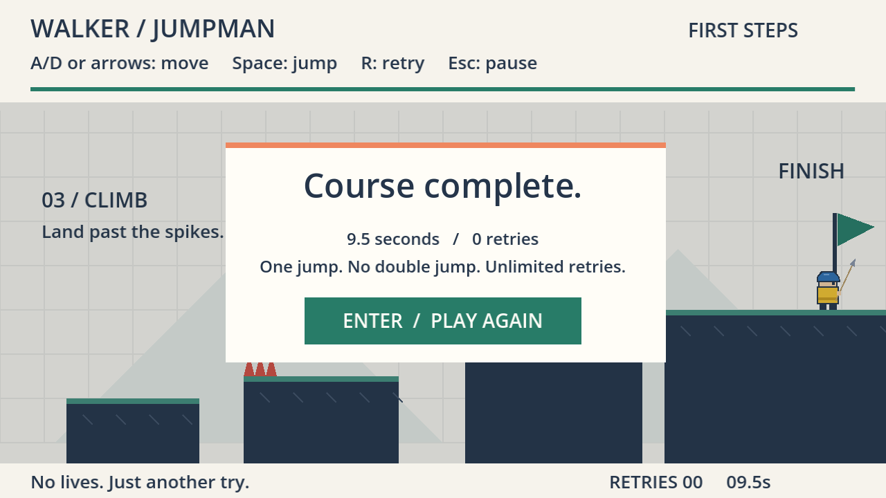

# walker-jumpman-jiean-yin

**Assignment 1 — Extend Walker Jumpman · Jiean Yin · Godot 4.7.2 / GDScript**

An extension of Professor Nik Bear Brown's **walker-jumpman "First Steps"** starter ([nikbearbrown/walker-jumpman](https://github.com/nikbearbrown/walker-jumpman), commit `9387542`). The starter's movement, jump tuning, collision, retry, pause and completion are kept. This project adds a new main character and a new playable section, "03 / CLIMB". The starter's original README is preserved as [STARTER-README.md](STARTER-README.md).



## What I changed

**New character: a helmeted spear-carrier.** Yellow tunic with a dark outline, blue dome helmet whose brim points forward, an eye on the facing side, and a thin decorative spear. The spear stands upright when idle or airborne and tilts toward the movement while running. On death the eyes become **XX**, the spear is lost, and the body hops up and falls away. A gap death, which happens below the screen, pops up from the bottom edge so it can still be seen. All of this is drawing only: the 18×28 collider and movement tuning are unchanged.

**New level section, "03 / CLIMB".** After the original course (x 0–960), four new landings climb from y 288 to y 224:

| Landing | Challenge |
|---|---|
| L1 | First step up; a clean teaching jump |
| L2 | Spikes on the **near** edge: a short hop lands on them; commit to a full jump |
| L3 | Spikes on the **far** edge: take off **before** them, not at the edge |
| L4 | The finish plateau; the flag moved from x 916 to x 1560 |

The single jump is unchanged, so every landing asks *how far, and when?* The level is 1600 px wide, up from 960.

**Consistency fixes the extension needed.** In the starter, spikes, the flag, the "FINISH" label, the background and the progress bar were drawn at hard-coded positions. Moving only the level data drew the new spikes at floor height while their collision sat on the landing tops. Now one `spike_triangles()` function feeds **both** collision and drawing, and the rest is drawn from the level data.

**Debug aid:** **F3** outlines the real collision box (display only).

Full details: [CHANGE-BRIEF.md](CHANGE-BRIEF.md) (predictions and revisions) · [TEST-REPORT.md](TEST-REPORT.md) (results) · [FRICTIONAL.md](FRICTIONAL.md) (honest log) · [SOURCES.md](SOURCES.md) (credits and human/AI contributions).

## Run it

Requires the regular **Godot 4.7.2** engine (no .NET, no external assets).

```bash
git clone https://github.com/Jiean-Yin/walker-jumpman-jiean-yin.git
cd walker-jumpman-jiean-yin
```

- **Any platform, editor:** open Godot, **Import**, choose `godot/project.godot`, then press **Run** (F5).
- **Windows, command line** (tested; adjust the path to where you unzipped Godot):

  ```bash
  C:/Godot/Godot_v4.7.2-stable_win64.exe --path godot
  ```

- **macOS:** the starter's [walker-jumpman.command](walker-jumpman.command) launcher is kept but was **not tested** in this project.

## Controls

| Key | Action |
|---|---|
| **Enter** | Start / resume / play again |
| **A / D** or **← / →** | Move |
| **Space** | Jump (one fixed-height jump; no double jump) |
| **R** | Retry the attempt |
| **Esc** or **P** | Pause |
| **M** | Main menu (from pause or results) |
| **F3** | Show/hide the collision box (debug; added by this project) |

Reach the flag at the top of the climb. Retries are unlimited; a spike or a fall restarts you at the spawn point.

## Tests

On the tested revision (`eb851a6`), **58/58** automated checks pass: the starter's 25 mechanics and 9 keyboard checks, plus 12 character and 12 level-extension checks added by this project. From the repository root:

```bash
C:/Godot/Godot_v4.7.2-stable_win64_console.exe --headless --path godot --script res://tests/test_game.gd
C:/Godot/Godot_v4.7.2-stable_win64_console.exe --headless --path godot --script res://tests/test_keyboard.gd
C:/Godot/Godot_v4.7.2-stable_win64_console.exe --headless --path godot --script res://tests/test_character.gd
C:/Godot/Godot_v4.7.2-stable_win64_console.exe --headless --path godot --script res://tests/test_level.gd
```

Each run writes a timestamped report to `evidence/`. The starter's route fixture was extended with four jump marks for the new landings; no starter assertion was weakened. The one failing run, the old route falling into the new gap, is kept as evidence. The author also played it with normal controls: see [TEST-REPORT.md §6](TEST-REPORT.md#6-human-playtest-session-record-jiean).

## Known limitations

- Jumping and falling use the idle pose; airborne state is shown by motion only.
- The spear is decoration outside the collider; its tip can appear to touch a spike without any contact.
- A death restarts the whole level (no checkpoints, as in the starter). A full run takes the author under 20 seconds.
- Difficulty was checked by one experienced human tester (the author) and by scripted routes; there is no evidence yet for new players.
- Tested on Windows 11 only. `evidence/build-manifest.json` is still the starter's; source hashes were not regenerated (Windows line-ending conversion changes file bytes).

## Explainer film

*Not yet produced.* It will be made with Brutalist's `godot-waikthrough` skill (`walker` modifier), rendered in 4K. MP4 files stay out of GitHub, so this section will link the course media copy and give the film's filename, SHA-256 checksum, and the game-source revision it shows.

## Credits

- **Starter:** walker-jumpman "First Steps" by Nik Bear Brown ([nikbearbrown/walker-jumpman](https://github.com/nikbearbrown/walker-jumpman)). Its design package (`GAME-BRIEF.md`, `GDD.md`, `LEVEL-DESIGN.md`, `PRODUCTION-PLAN.md`, `PLAYTEST-PLAN.md`, `ASSET-PLAN.md`, `DESIGN-REVIEW.md`, `DESIGN-STATUS.json`, `BUILD-REPORT.md`, `design/`) and original evidence are kept unchanged as the starter's record.
- **This extension:** Jiean Yin, with implementation assistance from Claude Code (Anthropic). See [SOURCES.md](SOURCES.md) for exactly what each contributed.
- No imported art, audio or fonts; all visuals are original geometric drawing in GDScript.
